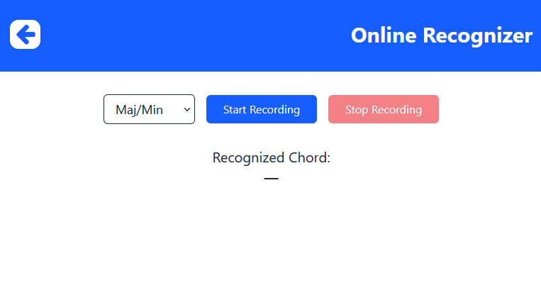
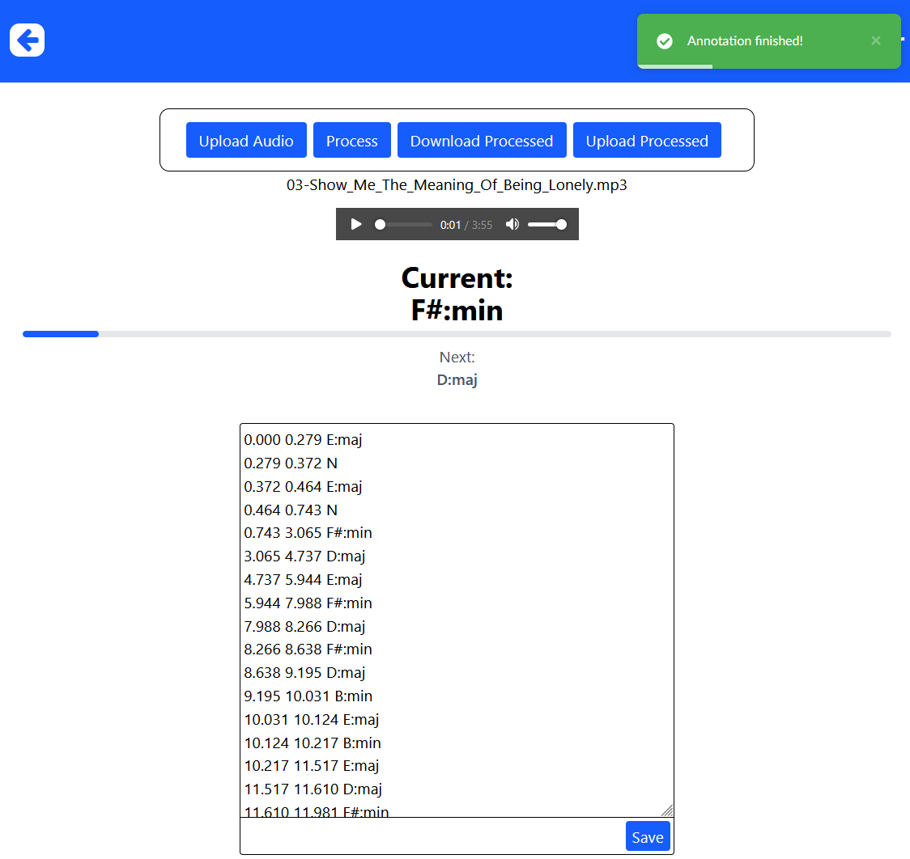
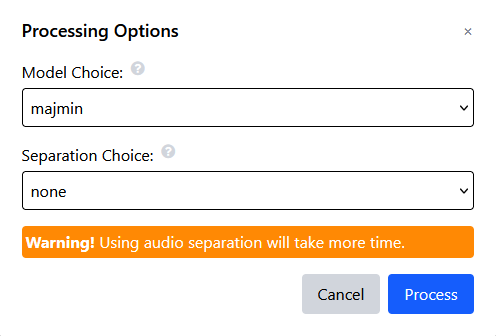

# Akordio
Tento repozitář obsahuje kód pro webovou aplikaci poskytující funkcionality rozpoznávání akordů a separaci instrumentů

## Zprovoznění aplikace
Spuštění aplikace lze provést přes docker pomocí následujících kroků:
  1) Klonování repozitáře i se submodulem.
      - `git clone git@github.com:jakubsilhan/Akordio_Web.git --recurse-submodules`
  2) Tvorba kontejnerů a spuštění.
      - `docker compose up -d --build`

### Úprava Portů
Změnu portů lze provést změnou parametrů v `docker-compose.yml`.

### Škálování
Výpočetní část aplikace lze škálovat přidáním více `celery` služeb v `docker-compose.yml`.

## Obsah
Aplikace se skládá ze dvou částí
- __Frontend:__ Kód pro klientovu část aplikace
- __Backend:__  Kód pro serverovou část aplikace

## Návod použití
Při načtení stránky se zobrazí hlavní navigační menu, které umožňuje přechod mezi online a offline režimem práce.

### Online
Online režim umožňuje provádět rozpoznávání akordů přímo z mikrofonu v 0,5 sekundových intervalech.  

Uživatel si může v seznamu vybrat, jakou kategorii akordů pro rozpoznávání využít:
- MajMin - pouze klasické durové a mollové akordy
- MajMin7 - durové a mollové akordy doplněné o akordy sedmičkové
- Complex - všechny akordy MajMin7 + akordy dim, aug, min6, maj6, minmaj7, dim7, hdim7, sus2, sus4

Poté již stačí zpustit rozpoznávání přes tlačítko "Start Recording" a vypnout ho přes "Stop Recording".
Nalezený akord je zobrazen v oblasti "Recognized Chord:".

### Offline
Offline režim umožňuje provádět anotaci celých nahrávek.  

Práce zde začíná nejprve nahráním zvukového souboru z počítače přes tlačítko "Upload Audio".
Audio je zde ihned dodáno do hudebního přehrávače.

Následně je možné audio dále zpracovat tlačítkem "Process", které zobrazí dodatečné menu s nastavením zpracování.  
V tomto menu probíhá stejná volba kategorie akordů jako v online režimu:
- MajMin - pouze klasické durové a mollové akordy
- MajMin7 - durové a mollové akordy doplněné o akordy sedmičkové
- Complex - všechny akordy MajMin7 + akordy dim, aug, min6, maj6, minmaj7, dim7, hdim7, sus2, sus4
Dodatečně zde lze zvolit či a jakou separaci instrumentů provést:
- None - separace není provedena
- Guitar - je odstraněna stopa kytary
- Vocals - je odstraněna hlasová stopa
- Both - je odstraněna kytara i hlas  

Po zpracování jsou anotace vidět v editoru, který lze použít k jejich další úpravě. Současně je v sekci "Current:" zobrazován aktuálně hraný akord dle používaného přehrávače. Navíc je zde doplněn i následující akord a zobrazení času do následujícího akordu.

Anotaci i upravenou nahrávku si lze uložit přes tlačítko "Download Processed", které obojí zabalí do archivu a stáhne. Jelikož jsou anotace v jednoduchém textovém souboru, lze s nimi poté dále pracovat i lokálně. Také je zde možnost zpětného nahrání pro další případné zpracování či přehrání přes tlačítko "Upload Processed".

